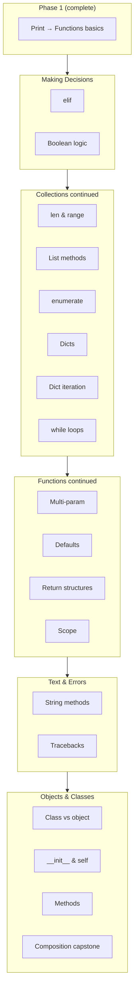

# Phase 2 Curriculum Plan

**Status:** Planning only — not yet implemented. Awaiting approval before authoring lesson JSON.

**Scope:** Continue immediately after Phase 1 (`functions_01_basics`) through **basic classes and introductory has-a composition**, stopping before Phase 3 (inheritance, `try`/`except`, advanced debugging, comprehensions).

**Size:** **18 new lessons** (26 total with Phase 1’s 8).

**Difficulty arc:** Phase 1 averages ~2; Phase 2 ramps **2 → 4–5** (capstone).

**Pedagogical thread:** RPG/adventure theme (Aria, Rook, Mira, Selene; HP, gold, inventory, party, quests) to build durable mental models, not just syntax drills.

---

## Executive synthesis

Three specialist reviews converge on the same conclusion:

| Dimension | Verdict |
|-----------|---------|
| **Curriculum sequencing** | Phase 1 covers print → variables → f-strings → if/else → lists/append/for → basic functions. Phase 2 should deepen control flow, collections (dicts, while), functions (params, scope, returning structures), then text/errors, then OOP ending in composition. |
| **Assessment** | Current checker is sufficient if exercises use **function wrappers** with 4–6 behavioral cases, class tests via `expression`/`attribute`, and architecture/predict for reasoning. Minor engine extensions (`while_loop`, `elif_branch` AST features) are nice-to-have, not blocking. |
| **UI readiness** | **`fill_blank`, `debug`, `write_code`** work well today. **Architecture MCQ, traceback reading, multi-line output, and `mini_project`** need UI work or authoring workarounds (see [UI authoring constraints](#ui-authoring-constraints-for-phase-2)). |

**Recommended sequencing adjustment:** teach **`len`/`range`/`enumerate` before `while`**, and **`scope` after dictionaries** so learners have seen locals inside loops and dict access before UnboundLocalError reasoning.

---

## Phase 1 foundation (complete)

**8 lessons, 25 exercises, 4 sections** — linear unlock, behavior-based grading.

| # | ID | Section | Title |
|---|-----|---------|-------|
| 1 | `fundamentals_01_print` | Python Fundamentals | Print and Comments |
| 2 | `fundamentals_02_variables` | Python Fundamentals | Variables, Types, and Assignment |
| 3 | `fundamentals_03_fstrings` | Python Fundamentals | Strings and f-strings |
| 4 | `decisions_01_conditionals` | Making Decisions | If and else |
| 5 | `collections_01_lists` | Collections | Lists and Indexing |
| 6 | `collections_02_append` | Collections | Growing a List |
| 7 | `collections_03_loops` | Collections | Repeating with for |
| 8 | `functions_01_basics` | Functions | Defining Functions and return |

**Engine-ready but unused in Phase 1:** `class_defined`, `expression`, `attribute`, `raises`, `mini_project`, `reference_solution`, `allowed_modules`.

**Mastery topics tracked but without content:** `classes`, `composition`, `inheritance`, `debugging`.

---

## Phase 2 lesson map



---

## UI authoring constraints for Phase 2

These affect how lessons should be written until UI enhancements land:

| Constraint | Workaround for Phase 2 authoring |
|------------|----------------------------------|
| Architecture `choices` not rendered | **Paste numbered options into every `prompt`** |
| Predict panel capped at ~88px | Keep `code_to_predict` ≤ 4 lines |
| Answer field is single-line | Multi-line predict answers should be avoided or expressed as `"line1\\nline2"` with clear prompt |
| Output panel ~96px | Prefer `stdout_contains`; limit printed lines to 3–4 |
| Run output overwritten by Check | Debug/traceback prompts must say **"Run first to see the error"** |
| `mini_project` = `write_code` in UI | Capstone → **3–4 sequential exercises** in one lesson, not one blob |
| No class-specific feedback polish | Write explicit `message` on each class test |

**UI enhancements to request before Phase 2 polish pass:** render architecture choices, expandable traceback/output panels, exercise-type badges, editor auto-hide for non-code exercises, separate hint surface.

---

## Section 2: Making Decisions (continued)

### Lesson 9 — `decisions_02_elif`

**Title:** More Than Two Outcomes with elif

**Learning objective:** Choose among three or more paths using `if` / `elif` / `else`; trace which block runs for a given value and explain why only one runs.

**Prerequisites:** `decisions_01_conditionals`, comparisons (`>`, `>=`, `==`), variables, f-strings

**Concepts introduced:** `elif`, ordered branch chains, "first true wins," optional final `else`

**Concepts reviewed:** Boolean conditions, indentation, comparisons, f-strings for status output

**Examples:**

```python
# Health tier
health = 35
if health >= 80:
    print("healthy")
elif health >= 30:
    print("wounded")
else:
    print("critical")
```

```python
# Quest purchasing chain
gold = 12
if gold >= 50:
    print("buy armor")
elif gold >= 10:
    print("buy potion")
else:
    print("save up")
```

```python
# Prediction: level = 5 → only "B" prints
if level >= 10: print("A")
elif level >= 5: print("B")
else: print("C")
```

**Exercise progression:**

| # | Type | Focus | Difficulty |
|---|------|-------|------------|
| 1 | `predict_output` | Trace 3-branch health tier | ★ confirm |
| 2 | `fill_blank` | Complete missing `elif` condition | ★★ guided |
| 3 | `write_code` | `wound_label(health)` via function wrapper | ★★★ independent |
| 4 | `architecture` | Why `elif` chain vs three separate `if`s | ★★ reasoning |

**Assessment strategy:**

- **Ex 1:** `expected_answer` exact match; failure hints at top-to-bottom evaluation without revealing unprinted branches.
- **Ex 2–3:** Wrap as `def wound_label(health): ...` with **4+ `function` tests**: `(100,"Healthy")`, `(50,"Wounded")`, `(0,"KO")`, `(1,"Wounded")` — catches hardcoding for starter value only.
- **Valid alternatives:** `>=` boundary reordering if behavior identical.
- **Must fail:** `if health == 25: return "Wounded"`; three independent `if`s when chain is required.
- **Hints:** (1) Python checks conditions in order; first true block wins → (2) middle tier needs `elif`, not second `if` → (3) high → medium → else structure.
- **Failure feedback:** "Worked for health=25, but …" via existing function feedback.

**Likely misconceptions:** `else if` (invalid syntax); overlapping conditions where learners think multiple blocks run; forgetting `elif` only runs when all earlier conditions were false.

**Relative difficulty:** **2**

---

### Lesson 10 — `decisions_03_boolean_logic`

**Title:** Combining Conditions with and, or, and not

**Learning objective:** Build compound conditions; evaluate short-circuit logic; use chained comparisons (`0 < health <= 100`).

**Prerequisites:** `decisions_02_elif`, comparisons

**Concepts introduced:** `and`, `or`, `not`, truthiness (intro level), chained comparisons

**Concepts reviewed:** if/elif/else, `==` vs `=`, numeric comparisons

**Examples:**

```python
has_key = True
level = 4
if has_key and level >= 3:
    print("enter")
```

```python
health = 15
enemies = 3
if health < 20 or enemies >= 3:
    print("flee")
```

```python
health = 75
if 0 < health <= 100:
    print("valid")
```

**Exercise progression:**

| # | Type | Focus | Difficulty |
|---|------|-------|------------|
| 1 | `predict_output` | Evaluate `and`/`or` with given booleans | ★ |
| 2 | `fill_blank` | Insert `and` / `or` / `not` | ★★ |
| 3 | `debug` | Fix `=` vs `==` or wrong operator | ★★ |
| 4 | `write_code` | `can_enter(has_key, gold)` → `"enter"` / `"wait"` | ★★★ |
| 5 | `architecture` | Nested `if` vs single compound condition | ★★ |

**Assessment strategy:**

- **Ex 4:** `function` tests — visible: `(True, 15)→"enter"`, `(False, 15)→"wait"`; hidden: `(True, 9)`, `(False, 0)`, `(True, 100)`.
- **Must fail:** `if has_key: return "enter"` (ignores gold); lookup on two visible pairs only.
- **Ex 5:** Paste numbered choices in prompt (UI constraint); test choice resolution.

**Likely misconceptions:** English "or" vs logical `or`; assuming both sides of `and` always evaluate; chained comparison before understanding `health > 30 and health < 80`.

**Relative difficulty:** **2–3**

---

## Section 3: Collections (continued)

### Lesson 11 — `collections_04_len_range`

**Title:** Measuring and Generating Sequences with len and range

**Learning objective:** Use `len()` to measure size; use `range()` to generate numeric sequences; reason about off-by-one boundaries.

**Prerequisites:** lists, indexing, `for` loops

**Concepts introduced:** `len()`, `range(n)`, `range(start, stop)`, loop variable as counter

**Concepts reviewed:** zero-based indexing, `for` loops, f-strings

**Examples:**

```python
party = ["Aria", "Rook", "Mira"]
print(len(party))  # 3
```

```python
for turn in range(3):
    print(f"Turn {turn}")  # 0, 1, 2
```

```python
for floor in range(1, 4):
    print(f"Floor {floor}")  # 1, 2, 3
```

**Exercise progression:**

| # | Type | Focus | Difficulty |
|---|------|-------|------------|
| 1 | `predict_output` | `len(inventory)` and small `range` loop | ★ |
| 2 | `fill_blank` | Complete `range(...)` to print 0..2 | ★★ |
| 3 | `write_code` | `last_item(items)` using `len` or negative index | ★★ |
| 4 | `write_code` | `numbered_lines(items)` with `enumerate(..., start=1)` | ★★★ |

**Assessment strategy:**

- **Ex 3:** `function` with `["a","b","c"]`, `["solo"]`, `[]` (define empty behavior: `None` or raise), `[1,2,3,4]`.
- **Must pass:** `items[-1]` and `items[len(items)-1]` as equivalent alternatives.
- **Must fail:** hardcoded `"c"`; `return items[3]`.

**Likely misconceptions:** `range(3)` includes 3 (stop is exclusive); using `len` on a number; confusing index with count.

**Relative difficulty:** **2**

---

### Lesson 12 — `collections_05_list_methods`

**Title:** Checking and Changing Lists with in, remove, and pop

**Learning objective:** Test membership with `in`; remove items by value or index; predict in-place mutation after each operation.

**Prerequisites:** lists, `append`, loops, `len`

**Concepts introduced:** `in` / `not in`, `.remove(value)`, `.pop()` / `.pop(index)`, in-place mutation

**Concepts reviewed:** `append`, indexing, `for` loops, mutability

**Examples:**

```python
inventory = ["sword", "shield", "potion"]
if "potion" in inventory:
    print("ready")
```

```python
inventory.remove("torch")  # ValueError if missing — note in passing
last = inventory.pop()
first = inventory.pop(0)
```

**Exercise progression:**

| # | Type | Focus | Difficulty |
|---|------|-------|------------|
| 1 | `predict_output` | Trace list after `remove` / `pop` | ★ |
| 2 | `write_code` | `if "key" in items: print("found")` | ★★ |
| 3 | `debug` | Fix wrong `remove` argument or type | ★★ |
| 4 | `write_code` | Remove `"curse"` if present, print list | ★★★ |

**Likely misconceptions:** `remove` returns new list; index vs value confusion; modifying list during iteration.

**Relative difficulty:** **2–3**

---

### Lesson 13 — `collections_06_enumerate`

**Title:** Looping with Index and Value using enumerate

**Learning objective:** When both position and value matter, use `enumerate` instead of manual counters or `range(len)`.

**Prerequisites:** `for` loops, indexing, `len`/`range`

**Concepts introduced:** `enumerate(seq)`, unpacking `for i, item in enumerate(...)`, optional `start=`

**Concepts reviewed:** zero-based indexing, f-strings, labeled output

**Examples:**

```python
party = ["Aria", "Rook", "Mira"]
for i, name in enumerate(party):
    print(f"{i}: {name}")
```

```python
for rank, item in enumerate(inventory, start=1):
    print(f"{rank}. {item}")
```

**Exercise progression:**

| # | Type | Focus | Difficulty |
|---|------|-------|------------|
| 1 | `predict_output` | Small `enumerate` loop | ★ |
| 2 | `fill_blank` | Replace `range(len(...))` with `enumerate` | ★★ |
| 3 | `write_code` | Numbered quest log lines | ★★★ |
| 4 | `architecture` | `for item in list` vs `enumerate` given task | ★★ |

**Likely misconceptions:** unpacking `i, item` feels magical; off-by-one with `start=1`.

**Relative difficulty:** **3**

---

### Lesson 14 — `collections_07_dictionaries`

**Title:** Storing Labeled Data in Dictionaries

**Learning objective:** Create dicts; read/update values by key; model entity stats as labeled data instead of parallel lists.

**Prerequisites:** variables, strings, indexing concept (keys vs integer indices)

**Concepts introduced:** `{key: value}`, `d["health"]`, assignment updates, keys as labels

**Concepts reviewed:** types, f-strings, comparisons on dict values

**Examples:**

```python
hero = {"name": "Mira", "health": 42, "gold": 10}
print(hero["name"])
hero["gold"] = hero["gold"] + 5
```

```python
stats = {"health": 80, "mana": 30}
if stats["health"] > 0:
    print("standing")
```

**Exercise progression:**

| # | Type | Focus | Difficulty |
|---|------|-------|------------|
| 1 | `predict_output` | Read/update small character dict | ★ |
| 2 | `fill_blank` | Complete key lookup and update | ★★ |
| 3 | `write_code` | `make_stats(name, hp, gold)` returns dict | ★★ |
| 4 | `write_code` | Purchase check using `if stats["gold"] >= price` | ★★★ |

**Likely misconceptions:** integer indices on dicts; `{` vs `[`; assuming key order matters for lookup.

**Relative difficulty:** **3**

---

### Lesson 15 — `collections_08_dict_iteration`

**Title:** Visiting Every Entry in a Dictionary

**Learning objective:** Loop over keys and key-value pairs; use `.get()` for safe reads with a default.

**Prerequisites:** `collections_07_dictionaries`, `for` loops

**Concepts introduced:** `for key in d`, `.items()`, `.get(key, default)`

**Concepts reviewed:** f-strings, unpacking, conditionals

**Examples:**

```python
inventory = {"sword": 1, "potion": 3}
for item, count in inventory.items():
    print(f"{item}: {count}")
```

```python
bonus = stats.get("luck", 0)  # 0 if missing
```

**Exercise progression:**

| # | Type | Focus | Difficulty |
|---|------|-------|------------|
| 1 | `predict_output` | Keys-only loop vs `.items()` | ★ |
| 2 | `write_code` | Print each `stat: value` line | ★★ |
| 3 | `debug` | Fix loop assuming `.items()` returns only keys | ★★ |
| 4 | `write_code` | `price(item, shop)` → price or `0` if missing | ★★★ |

**Assessment strategy:**

- **Ex 4:** 5 `function` tests passing shop dict as arg; must pass `.get(item, 0)` or `if item in shop`.
- **Must fail:** bare `shop[item]` when spec requires 0 for missing keys.

**Likely misconceptions:** `for x in dict` yields values; overusing `.get()` when key is guaranteed.

**Relative difficulty:** **3**

---

### Lesson 16 — `collections_09_while`

**Title:** Repeating While a Condition Holds

**Learning objective:** Use `while` for condition-driven repetition; trace loop exit; connect to infinite-loop safety (app timeout message).

**Prerequisites:** `decisions_03_boolean_logic`, variables, reassignment, **`collections_04_len_range`** (teach len/range before while)

**Concepts introduced:** `while condition:`, loop condition eventually false, counters/accumulators

**Concepts reviewed:** comparisons, compound conditions, reassignment, `print` tracing

**Examples:**

```python
shield = 3
while shield > 0:
    print("block")
    shield = shield - 1
print("broken")
```

```python
# Infinite loop warning — tie to app timeout
health = 50
while health > 0:
    print("still fighting")  # forgot to decrease
```

**Exercise progression:**

| # | Type | Focus | Difficulty |
|---|------|-------|------------|
| 1 | `predict_output` | Small finite `while` | ★ |
| 2 | `fill_blank` | Complete decrement so loop terminates | ★★ |
| 3 | `debug` | Fix missing update / infinite loop | ★★ |
| 4 | `write_code` | `drain_total(numbers)` pops until empty, returns sum | ★★★ |
| 5 | `architecture` | Choose `for` vs `while` | ★★ |

**Assessment strategy:**

- **Ex 4:** `function` with `[10,5,1]→16`, `[]→0`, `[7]`, `[1,1,1,1]`.
- Infinite loops caught by runner timeout — existing `TIMEOUT_MESSAGE`.
- Optional engine extension: `source_uses` feature `while_loop`.

**Likely misconceptions:** `while` vs `for` selection; forgetting to update loop variable; using `while` when `for item in collection` is simpler.

**Relative difficulty:** **3–4**

---

## Section 4: Functions (continued)

### Lesson 17 — `functions_02_parameters`

**Title:** Functions with Multiple Parameters

**Learning objective:** Define and call functions with two or more parameters; understand argument order; pass collections into functions.

**Prerequisites:** `functions_01_basics`, lists, dicts

**Concepts introduced:** Multi-parameter signatures, argument order, passing list/dict into functions

**Concepts reviewed:** `return`, f-strings, dict/list access inside functions

**Examples:**

```python
def damage(attack, defense):
    return max(0, attack - defense)
```

```python
def item_line(name, qty):
    return f"- {qty}x {name}"
```

**Exercise progression:**

| # | Type | Focus | Difficulty |
|---|------|-------|------------|
| 1 | `predict_output` | Call with two args | ★ |
| 2 | `fill_blank` | Complete signature/body | ★★ |
| 3 | `write_code` | `apply_bonus(stats, amount)` returns new health | ★★ |
| 4 | `write_code` | `party_summary(names, leader_index)` returns f-string | ★★★ |

**Likely misconceptions:** argument order swapped; mutating global vs returning new value (preview scope lesson).

**Relative difficulty:** **2–3**

---

### Lesson 18 — `functions_03_defaults`

**Title:** Optional Parameters with Default Values

**Learning objective:** Give parameters defaults; call with fewer arguments; reason about which value binds where.

**Prerequisites:** `functions_02_parameters`

**Concepts introduced:** `def greet(name, title="Traveler")`, optional omission

**Concepts reviewed:** return, f-strings, multiple parameters

**Examples:**

```python
def greet(name, title="Traveler"):
    return f"Welcome, {title} {name}"

print(greet("Mira"))
print(greet("Mira", "Captain"))
```

```python
def heal(health, amount=10):
    return health + amount
```

**Exercise progression:**

| # | Type | Focus | Difficulty |
|---|------|-------|------------|
| 1 | `predict_output` | Call with and without optional arg | ★ |
| 2 | `fill_blank` | Add default parameter | ★★ |
| 3 | `write_code` | `format_loot(item, quantity=1)` | ★★ |
| 4 | `architecture` | When defaults help vs always explicit | ★★ |

**Assessment strategy:**

- Include `kwargs` test: `greet("X", title="Guide")`.
- **Must fail:** hardcoding `"Traveler"` in body ignoring parameter.
- **Warn only:** mutable default args (`def f(items=[])`) — defer deep dive to Phase 3.

**Likely misconceptions:** non-default params after defaults (syntax error); mutable defaults.

**Relative difficulty:** **3**

---

### Lesson 19 — `functions_04_returning_data`

**Title:** Returning Lists and Dictionaries from Functions

**Learning objective:** Build and return structured data; caller stores and uses the result — reinforcing print vs return at scale.

**Prerequisites:** functions, lists, dicts, loops

**Concepts introduced:** Returning composite values; assembling dict/list in function body

**Concepts reviewed:** `return` vs `print`, `for`, `append`, dict literals

**Examples:**

```python
def make_character(name, health):
    return {"name": name, "health": health}
```

```python
def add_item(inventory, item):
    result = list(inventory)
    result.append(item)
    return result  # contrast with in-place append lesson
```

**Exercise progression:**

| # | Type | Focus | Difficulty |
|---|------|-------|------------|
| 1 | `predict_output` | Function returns dict; caller indexes | ★ |
| 2 | `write_code` | `new_quest(title, reward)` returns dict | ★★ |
| 3 | `write_code` | `add_item(inventory, item)` returns **new** list | ★★★ |
| 4 | `mini_project`* | `build_party()` + `format_roster(party)` | ★★★ |

*Author as 2 sequential `write_code` exercises (UI constraint).

**Likely misconceptions:** returning `None`; aliasing same mutable list every call.

**Relative difficulty:** **3**

---

### Lesson 20 — `functions_05_scope`

**Title:** Local Names and Global Names

**Learning objective:** Predict whether a name is local or global; understand parameters are local; prefer return over global mutation.

**Prerequisites:** functions, assignment, **`collections_07_dictionaries`** (locals seen in loops/dicts first)

**Concepts introduced:** Local scope in function body, module-level globals, read global vs assign local

**Concepts reviewed:** parameters, return, NameError

**Examples:**

```python
gold = 100

def spend(amount):
    remaining = gold - amount  # read global, local remaining
    return remaining
```

```python
def double(x):
    x = x * 2  # local rebinding only
    return x
```

**Exercise progression:**

| # | Type | Focus | Difficulty |
|---|------|-------|------------|
| 1 | `predict_output` | Parameter shadows outer variable | ★ |
| 2 | `predict_output` / `architecture` | Assignment inside function doesn't change outer | ★★ |
| 3 | `debug` | Fix UnboundLocalError via parameter/return | ★★★ |
| 4 | `write_code` | Pure `apply_damage(health, hit)` — no globals | ★★★ |
| 5 | `architecture` | Return vs mutating global gold | ★★ |

**Assessment strategy:**

- Starter includes misleading global `score=999`; `expression` verifies global unchanged after call.
- **`global` keyword:** mention exists; do not require in Phase 2.

**Likely misconceptions:** assignment inside function updates global automatically; parameters as persistent "memory" between calls.

**Relative difficulty:** **3–4**

---

## Section 5: Working with Text

### Lesson 21 — `strings_01_methods`

**Title:** Cleaning and Comparing Strings with Methods

**Learning objective:** Use `.lower()`, `.upper()`, `.strip()`, `.split()`; substring checks with `in`; strings are immutable.

**Prerequisites:** strings, f-strings, functions, `in` from lists

**Concepts introduced:** Method call syntax on strings; immutability (methods return new strings)

**Concepts reviewed:** `in`, comparisons, conditionals

**Examples:**

```python
code = "  OPEN  "
if code.strip().lower() == "open":
    print("door unlocks")
```

```python
quest = "Find the Dragon Key"
if "key" in quest.lower():
    print("key quest")
```

**Exercise progression:**

| # | Type | Focus | Difficulty |
|---|------|-------|------------|
| 1 | `predict_output` | `strip().lower()` chain | ★ |
| 2 | `fill_blank` | Normalize input before compare | ★★ |
| 3 | `debug` | Fix `s.strip()` without reassignment | ★★ |
| 4 | `write_code` | `clean_command(text)` → stripped lowercase | ★★★ |

**Likely misconceptions:** strings mutate like lists; case-sensitive comparison bugs.

**Relative difficulty:** **2–3**

---

## Section 6: Reading Errors

### Lesson 22 — `errors_01_tracebacks`

**Title:** Reading Tracebacks and Common Errors

**Learning objective:** Read traceback bottom-up; identify error type and line; connect message to fix strategy.

**Prerequisites:** variables, functions, lists, dicts, scope intro

**Concepts introduced:** Traceback structure, `NameError`, `TypeError`, `IndexError`, `KeyError`, syntax error indicators

**Concepts reviewed:** scope, indexing, dict keys, function arity

**Examples:**

```python
# NameError
print(score)

# IndexError
party = ["Aria"]
print(party[3])

# KeyError
stats = {"health": 10}
print(stats["mana"])
```

**Exercise progression:**

| # | Type | Focus | Difficulty |
|---|------|-------|------------|
| 1 | `architecture` | Match error type to snippet | ★ |
| 2 | `debug` | Fix NameError (typo) | ★★ |
| 3 | `debug` | Fix TypeError (wrong arity) | ★★ |
| 4 | `debug` | Fix IndexError (off-by-one) | ★★★ |
| 5 | `architecture` | Match error message to likely cause | ★★ |

**Assessment strategy:**

- **UI constraint:** embed short tracebacks (~3 lines) in **`prompt`** as preformatted text, not long `code_to_predict`.
- Debug exercises: prompt must say **"Run first to see the error."**
- Architecture: paste all snippet/choice options in prompt.

**Likely misconceptions:** reading top of traceback first; treating all errors as "syntax errors"; random editing instead of tracing named line.

**Relative difficulty:** **3**

*Advanced debugging workflow (print debugging, bisection) deferred to Phase 3.*

---

## Section 7: Objects and Classes

### Lesson 23 — `classes_01_objects`

**Title:** Classes, Objects, and References

**Learning objective:** Distinguish class (blueprint) from object (instance); create instances; access attributes with dot notation.

**Prerequisites:** dicts (attribute analogy), functions (methods preview), types

**Concepts introduced:** `class Name:`, instantiation `Name()`, attribute access `obj.attr`, multiple independent instances

**Concepts reviewed:** dict key access vs dot access, f-strings

**Examples:**

```python
class Character:
    pass

hero = Character()
hero.name = "Mira"
hero.health = 40

a = Character()
b = Character()
a.name = "Rook"  # b.name is separate
```

**Exercise progression:**

| # | Type | Focus | Difficulty |
|---|------|-------|------------|
| 1 | `predict_output` | Two instances, different attributes | ★ |
| 2 | `fill_blank` | Create instance and set attributes | ★★ |
| 3 | `write_code` | Define `Item` class; create `sword` with `name` | ★★ |
| 4 | `architecture` | Dict vs object — when labeled fields + behavior suggest a class | ★★ |

**Assessment strategy:**

- Always pair `class_defined` with `expression` instantiation tests.
- Two-instance independence tests catch shared-state bugs early.
- Write explicit `message` on each test (UI lacks class-specific feedback polish).

**Likely misconceptions:** class and object are the same; attributes exist on class for all instances without assignment; `Character()` vs `Character`.

**Relative difficulty:** **3**

---

### Lesson 24 — `classes_02_init`

**Title:** Initializing Objects with __init__ and self

**Learning objective:** Write `__init__` to set initial state; understand `self` as the current instance reference.

**Prerequisites:** `classes_01_objects`, functions with parameters

**Concepts introduced:** `def __init__(self, ...)`, `self.attr = ...`, constructor runs on instantiation

**Concepts reviewed:** parameters, assignment, dict-like state

**Examples:**

```python
class Character:
    def __init__(self, name, health):
        self.name = name
        self.health = health

hero = Character("Mira", 42)
```

```python
class Quest:
    def __init__(self, title, reward):
        self.title = title
        self.reward = reward
```

**Exercise progression:**

| # | Type | Focus | Difficulty |
|---|------|-------|------------|
| 1 | `predict_output` | `__init__` sets attributes | ★ |
| 2 | `fill_blank` | Complete `__init__` body | ★★ |
| 3 | `write_code` | `Item(name, weight)` class | ★★ |
| 4 | `write_code` | `Character` with three stats; status via f-string outside class | ★★★ |

**Assessment strategy:**

- `expression`: `Character("A",10).hp` and `Character("B",99).hp`; verify `Character("A",10).hp` still 10 after creating B.
- **Must fail:** shared class-level variable for hp (tests detect mutation bleed).

**Likely misconceptions:** forgetting `self` in parameter list or assignments; calling `__init__` manually; treating `self` as optional magic.

**Relative difficulty:** **4**

---

### Lesson 25 — `classes_03_methods`

**Title:** Instance Methods and Using self

**Learning objective:** Define methods that read/update instance state; call via `obj.method()`; apply print vs return reasoning to methods.

**Prerequisites:** `classes_02_init`, `functions_01_basics`

**Concepts introduced:** Instance methods, `self` in method body, behavior + state together

**Concepts reviewed:** return vs print, mutating attributes, f-strings, conditionals

**Examples:**

```python
class Character:
    def __init__(self, name, health):
        self.name = name
        self.health = health

    def take_damage(self, amount):
        self.health = self.health - amount

    def is_standing(self):
        return self.health > 0

    def describe(self):
        return f"{self.name} has {self.health} HP"
```

**Exercise progression:**

| # | Type | Focus | Difficulty |
|---|------|-------|------------|
| 1 | `predict_output` | Method changes `health` | ★ |
| 2 | `fill_blank` | Implement one method with `self` | ★★ |
| 3 | `write_code` | `heal(amount)` method | ★★ |
| 4 | `architecture` | Should `describe` print or return? | ★★ |
| 5 | `write_code` | `Potion.use(character)` increases health | ★★★ |

**Assessment strategy:**

- Sequential `expression` tests in same namespace: create, heal(10), heal(5), read hp.
- Second object unaffected — independence test.
- **Debug exercise:** fix `def heal(amount):` missing `self` → TypeError.

**Likely misconceptions:** missing `self` on definition; `take_damage(5)` vs `hero.take_damage(5)`; methods outside class indentation.

**Relative difficulty:** **4**

---

### Lesson 26 — `classes_04_composition` *(Phase 2 capstone)*

**Title:** Objects Containing Other Objects (has-a)

**Learning objective:** Model has-a relationships: party has characters, character has inventory; delegate behavior without inheritance.

**Prerequisites:** classes, methods, lists, dicts, loops, functions returning objects

**Concepts introduced:** Composition, nested objects, list of instances, object references

**Concepts reviewed:** `append`, `for`, methods, f-strings, functions returning objects

**Examples:**

```python
class Character:
    def __init__(self, name):
        self.name = name
        self.inventory = []

    def pick_up(self, item):
        self.inventory.append(item)

class Party:
    def __init__(self, name):
        self.name = name
        self.members = []

    def add_member(self, character):
        self.members.append(character)

    def roster(self):
        for member in self.members:
            print(member.name)
```

**Exercise progression** (capstone split into 4–6 exercises — UI constraint):

| # | Type | Focus | Difficulty |
|---|------|-------|------------|
| 1 | `predict_output` | Party with two members after `add_member` | ★ |
| 2 | `fill_blank` | Complete `Party.add_member` | ★★ |
| 3 | `write_code` | `Character` with own `inventory` list in `__init__` | ★★★ |
| 4 | `write_code` | `total_hp(party)` sums `.hp` across members | ★★★★ |
| 5 | `architecture` | Composition vs "one big dict" vs inheritance | ★★ |
| 6 | `write_code` | **Guild Roster milestone:** Character + Party + add + roster + pick_up | ★★★★★ |

**Assessment strategy:**

- **Ex 3:** two characters, separate inventories — adding to one must not change the other's.
- **Ex 4:** `function` with empty list, one member, three members.
- **Ex 6 (capstone):** 8–12 mixed `function` + `expression` tests; verify method mutation + formatted output.
- **Must fail:** shared global inventory list; inheritance-based "Party inherits list."
- Explicitly defer inheritance to Phase 3 in architecture exercise choices.

**Likely misconceptions:** jumping to inheritance; storing only names when objects needed for behavior; class attributes vs instance lists shared across instances.

**Relative difficulty:** **4–5**

---

## Cross-phase retrieval map

| Phase 1 concept | Phase 2 retrieval hotspots |
|-----------------|---------------------------|
| f-strings | decisions, enumerate, functions, all class lessons |
| if/else | decisions 02–03, list methods, strings, class methods |
| lists + indexing | collections 04–09, functions 04, composition |
| append | collections 05; contrast with return-new-list in functions 04 |
| for loops | collections 04–09, dict iteration, class rosters |
| def / return | every Functions lesson + class methods |
| print vs return | functions 04, classes 03, architecture exercises |

---

## Explicit Phase 2 boundaries (deferred to Phase 3)

| Topic | Rationale |
|-------|-----------|
| Inheritance, `super()` | Composition taught first per pedagogy rules |
| `@property`, dunder beyond `__init__` | Cognitive load |
| List/dict comprehensions | Syntax sugar before reasoning foundations |
| `try` / `except` | Error *reading* first; handling in Phase 3 |
| Advanced debugging workflow | Phase 3 |
| Mutable default parameters (deep dive) | Mention only in Lesson 18 |
| Class/static methods | Not basic OOP |
| `global` keyword mastery | Mention in scope; prefer return pattern |

---

## Engine extensions (recommended, not blocking)

| Extension | Purpose |
|-----------|---------|
| `source_uses`: `while_loop`, `elif_branch`, `enumerate_call` | Enforce construct when literals pass |
| `source_uses`: `default_param` | Verify defaults in signature |
| Richer class failure messages | Parallel to function `improve_function_feedback` |
| Optional `hidden: true` on tests | Future UI differentiation |

---

## Mastery topics to add at implementation

Extend `engine/progress.py` topic labels: `boolean_logic`, `loops_while`, `dictionaries`, `scope`, `errors`, `classes`, `composition`.

---

## Phase 2 exit criteria

After Lesson 26, a learner should be able to:

- Branch on complex conditions and combine predicates
- Work with lists, dicts, `while`/`for`/`enumerate`/`range`/`len`
- Write multi-parameter functions with defaults; return structured data; reason about scope
- Normalize strings and read common tracebacks
- Define classes with `__init__` and methods; build small multi-object programs with has-a composition
- Write small multi-function / multi-class scripts independently

This prepares them for **Phase 3**: inheritance, `try`/`except`, debugging practice, and project milestones.

---

## Summary table

| # | ID | Title | Difficulty |
|---|-----|-------|------------|
| 9 | `decisions_02_elif` | More Than Two Outcomes with elif | 2 |
| 10 | `decisions_03_boolean_logic` | Combining Conditions with and, or, and not | 2–3 |
| 11 | `collections_04_len_range` | Measuring and Generating Sequences with len and range | 2 |
| 12 | `collections_05_list_methods` | Checking and Changing Lists with in, remove, and pop | 2–3 |
| 13 | `collections_06_enumerate` | Looping with Index and Value using enumerate | 3 |
| 14 | `collections_07_dictionaries` | Storing Labeled Data in Dictionaries | 3 |
| 15 | `collections_08_dict_iteration` | Visiting Every Entry in a Dictionary | 3 |
| 16 | `collections_09_while` | Repeating While a Condition Holds | 3–4 |
| 17 | `functions_02_parameters` | Functions with Multiple Parameters | 2–3 |
| 18 | `functions_03_defaults` | Optional Parameters with Default Values | 3 |
| 19 | `functions_04_returning_data` | Returning Lists and Dictionaries from Functions | 3 |
| 20 | `functions_05_scope` | Local Names and Global Names | 3–4 |
| 21 | `strings_01_methods` | Cleaning and Comparing Strings with Methods | 2–3 |
| 22 | `errors_01_tracebacks` | Reading Tracebacks and Common Errors | 3 |
| 23 | `classes_01_objects` | Classes, Objects, and References | 3 |
| 24 | `classes_02_init` | Initializing Objects with __init__ and self | 4 |
| 25 | `classes_03_methods` | Instance Methods and Using self | 4 |
| 26 | `classes_04_composition` | Objects Containing Other Objects (has-a) | 4–5 |

---

## Approval decisions (pending)

Before implementation, confirm:

1. **Lesson count (18)** — acceptable scope, or prefer a shorter Phase 2 (e.g. defer `strings_01_methods` or merge dict lessons)?
2. **UI work timing** — implement lessons with authoring workarounds first, or block on architecture-choice rendering and expandable output panels?
3. **Capstone shape** — 4–6 sequential exercises in `classes_04_composition` vs one `mini_project` after UI support?
4. **Sequencing** — approve `len`/`range` before `while` and `scope` after dicts?

Once approved, implementation proceeds lesson-by-lesson as JSON files under `course/lessons/` with no GUI changes required for the core path.

---

## Related documents

- `README.md` — Phase roadmap overview
- `course/lessons/README.md` — Lesson JSON authoring checklist
- `.cursor/rules/pedagogy.mdc` — Teaching principles
- `.cursor/rules/exercise-quality.mdc` — Assessment quality rules
