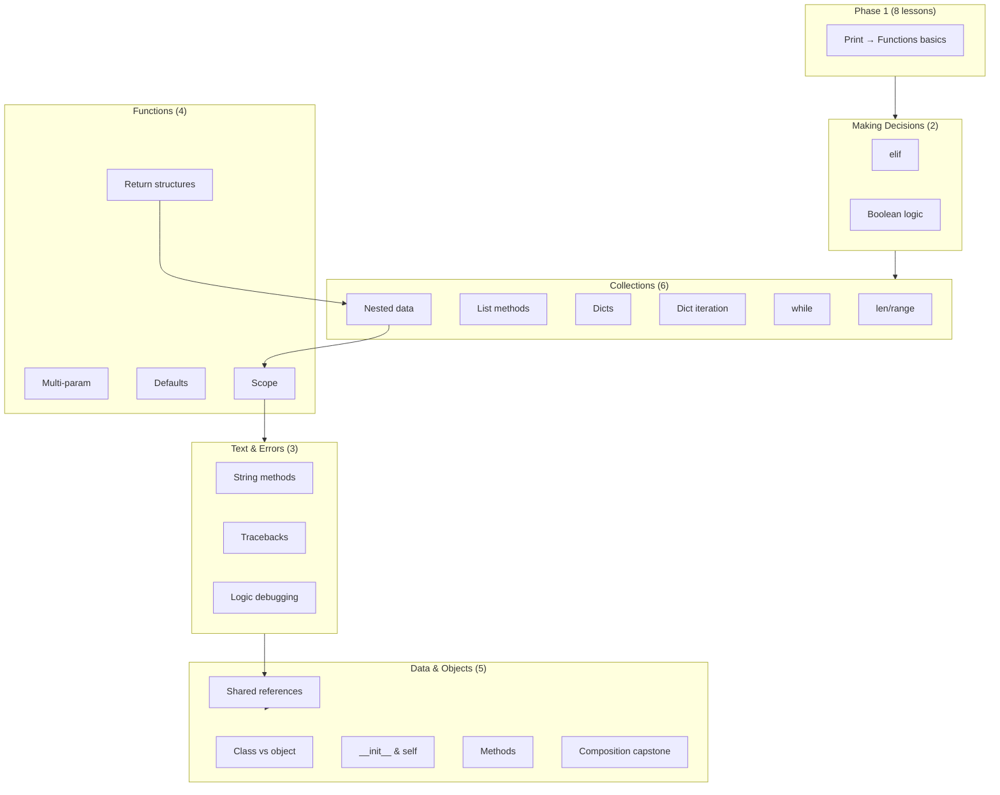

# Phase 2 Curriculum Plan (Revised)

**Status:** Curriculum-design approval stage — **revised per targeted feedback (Aug 2026)**. Not yet implemented.

**Scope:** Continue immediately after Phase 1 (`functions_01_basics`) through **basic classes and introductory has-a composition**, stopping before Phase 3 (inheritance, `try`/`except`, advanced debugging, comprehensions).

**Size:** **20 new lessons** (28 total with Phase 1’s 8).

**Difficulty arc:** Phase 1 averages ~2; Phase 2 ramps **2 → 4–5** (capstone).

**Pedagogical thread:** RPG/adventure theme when it improves continuity (Aria, Rook, Mira, Selene; HP, gold, inventory, party, quests). Use simpler non-RPG examples when they teach more clearly.

**Implementation order:** **UI P0 prerequisites first**, then lesson JSON authoring. Do not author 20 lessons around temporary UI workarounds.

---

## Executive synthesis (revised)

| Dimension | Verdict |
|-----------|---------|
| **Curriculum sequencing** | Preserve Phase 1 → deeper decisions → deeper collections → deeper functions → strings/errors → **data modeling (references)** → classes → composition. Remove standalone enumerate; add nested-data and shared-references lessons; add second debugging lesson. |
| **Assessment** | Current checker is sufficient: **`function`** wrappers (4–6 cases), **`expression`** for nested paths and **`is`** for aliasing, **`class_defined` + expression**, distributed **`debug`** exercises. Explicit `message` on class tests until engine feedback improves. |
| **Debugging** | A **thread across all 20 lessons**, not a single traceback unit. Dedicated Lessons 22 (reading errors) and 23 (logic bugs). |
| **UI readiness** | **Block curriculum JSON on P0 UI** (choices rendering, output panel size, Run/Check separation). See [UI prerequisites](#ui-prerequisites-before-curriculum-implementation). |

### What changed from the first plan (v1)

| Feedback area | Revision |
|---------------|----------|
| Enumerate standalone lesson | **Removed**; preview via `range(len(...))` in Lesson 11; formal `enumerate` in Lesson 19 where index + member both matter |
| Nested data | **New Lesson 19** — lists of dicts, dicts with lists; bridge to composition |
| Debugging | **Throughout** + **new Lesson 23** (logic bugs / value tracing) |
| References / mutation | **New Lesson 24** — aliasing, shared mutable state, copy vs rebind; bridge to OOP |
| Composition capstone | **Redesigned** — incremental construction from specs, cumulative skills, no large pasted class defs |
| UI | **Do not workaround** — minimum P0 UI before authoring |

---

## Phase 1 foundation (complete — Basilisk V2)

**8 lessons, 28 exercises, 4 sections** — linear unlock, behavior-based grading.
Phase 1 follows the full Basilisk teaching rhythm (predict, debug, retrieve,
integrate). Stable lesson IDs are unchanged so saved progress and later
prerequisites remain compatible.

| # | ID | Section | Title |
|---|-----|---------|-------|
| 1 | `fundamentals_01_print` | Python Fundamentals | Leave a Trace |
| 2 | `fundamentals_02_variables` | Python Fundamentals | Store the Record |
| 3 | `fundamentals_03_fstrings` | Python Fundamentals | Assemble the Report |
| 4 | `decisions_01_conditionals` | Making Decisions | Make a Decision |
| 5 | `collections_01_lists` | Collections | Organize the Expedition |
| 6 | `collections_02_append` | Collections | Record New Evidence |
| 7 | `collections_03_loops` | Collections | Search Every Entry |
| 8 | `functions_01_basics` | Functions | Build an Investigation Tool |

### Lessons 9–13 (Expedition Intake System — implemented)

These five lessons unlock immediately after Phase 1 and grow one persistent
intake program. Stable IDs:

| # | ID | Title |
|---|-----|-------|
| 9 | `decisions_09_elif` | More Than Two Paths |
| 10 | `decisions_10_boolean_logic` | Decisions With More Than One Condition |
| 11 | `collections_11_len_range` | Count What You Have |
| 12 | `collections_12_list_methods` | Lists That Change |
| 13 | `collections_13_dictionaries` | One Record, Many Facts |

The remainder of this document’s Phase 2 map (Lessons 14+) remains the approved
later sequencing and is not implemented in this redesign.

## Phase 2 lesson map (revised)

---

## UI prerequisites before curriculum implementation

### Limitation classification

| # | Limitation | A: Fix before Phase 2 | B: Defer | C: Curriculum-only |
|---|------------|----------------------|----------|-------------------|
| 1 | Architecture `choices` not rendered | **Yes** — ~12+ reasoning exercises; Phase 1 `functions_01_ex2` already broken without UI | Styled radios, keyboard nav | **No** — prompt-paste is brittle |
| 2 | Predict panel ~88px cap | **Partial** — auto-height needed for reference/aliasing predicts | Syntax highlight in predict | Trivial predicts only (≤4 lines) |
| 3 | Single-line answer field | No | Multi-line answer widget | Yes for rare multi-line predicts |
| 4 | Output panel ~96px fixed | **Yes** — tracebacks, nested rosters, debug loop | Splitter memory, expand toggle | **No** — capping prints cripples nested data |
| 5 | Run output overwritten by Check | **Yes** — debug pedagogy requires Run → observe → fix | Full tabbed Output/Check/Hints | **No** — static traceback in prompt ≠ Run debugging |
| 6 | `mini_project` = `write_code` | No | Milestone UI, rubrics | **Yes** — capstone as sequential `write_code` |
| 7 | Class-specific feedback weak | No | Engine `improve_class_feedback()` | **Yes** — explicit `message` on each test |

### Minimum UI work (P0 — block curriculum until done)

| Priority | Change | Primary files | Unblocks |
|----------|--------|---------------|----------|
| **P0-1** | Render `exercise.choices` for architecture / choice exercises (numbered list or radio group) | `app/widgets/lesson_content.py`, optionally `ide_panel.py` | Architecture reasoning across Phase 2; fixes Phase 1 MCQ gap |
| **P0-2** | Enlarge output panel — remove fixed 96px; min ~140px + vertical stretch | `app/widgets/output_panel.py`, `ide_panel.py` | Tracebacks, multi-line output, nested-data rosters |
| **P0-3** | Separate Run output from Check feedback — Run → Output; Check → Feedback; hints not appended to Run output | `app/course_app.py`, `feedback_panel.py` | Debug exercises throughout; traceback lesson |

### High-value P1 (same UI pass if possible)

| Priority | Change | Primary files | Unblocks |
|----------|--------|---------------|----------|
| **P1-1** | Auto-height predict code panel (mirror `ExampleBlock`; max ~160–200px, scroll beyond) | `app/widgets/lesson_content.py` | elif/while/scope/reference predictions without dumbing down code |

### Safe to defer (Phase 2 polish / Phase 3)

Exercise-type badges, editor auto-hide for non-code exercises, dedicated hint surface, `mini_project` milestone UI, class feedback engine helper, multi-line free-text answer widget.

---

## Debugging spine (Phase 2)

Debugging is a **normal part of programming**, not a separate topic.

| Layer | Where | Practice |
|-------|-------|----------|
| **Micro (every lesson)** | All 20 Phase 2 lessons | ≥1 of: `debug`, `predict_output`, value-tracing `architecture`, or “what line fails?” |
| **Reading errors** | Lesson 22 `errors_01_tracebacks` | Traceback bottom-up; Name/Type/Index/Key/Syntax errors |
| **Logic bugs** | Lesson 23 `errors_02_debugging_logic` | Wrong output without crash; trace assumptions; elif/loop/off-by-one mistakes |

**Error-type exposure schedule**

| Error type | First explicit lesson | Reinforced in |
|------------|----------------------|---------------|
| Syntax | Phase 1 + Lesson 22 | defaults, methods |
| NameError | Lesson 22 | scope, shared references |
| TypeError | Lesson 22 | list methods, methods (missing `self`) |
| IndexError | Lesson 22 | len/range, nested data |
| KeyError | Lesson 22 | dicts, nested data |
| ValueError | Lesson 12 (remove) | while, nested data |
| Logic (no exception) | Lesson 10 (early) | **Lesson 23**, while, scope, composition |

**Debug exercise contract:** broken starter runs or fails predictably; learner uses **Run** to see error/output; **Check** validates behavior only. After P0-3 UI, prompts need not embed static tracebacks for fix-it exercises.

---

## Section 2: Making Decisions (continued)

### Lesson 9 — `decisions_02_elif`

| Field | Value |
|-------|-------|
| **Title** | More Than Two Outcomes with elif |
| **Learning objective** | Choose among three or more paths using `if` / `elif` / `else`; trace which single block runs and explain why. |
| **Prerequisites** | `decisions_01_conditionals`, comparisons, variables, f-strings |
| **Concepts introduced** | `elif`, ordered branch chains, “first true wins,” optional final `else` |
| **Concepts reviewed** | Boolean conditions, indentation, comparisons, f-strings |
| **Debugging** | Predict: boundary hits wrong tier (logic). Architecture: three separate `if`s vs `elif` chain — double-print bug. |
| **Examples** | Health tiers (`healthy` / `wounded` / `critical`); gold purchase chain |
| **Exercise progression** | predict → fill_blank → `write_code` `wound_label(health)` → architecture |
| **Assessment** | `function` 4+ cases on `wound_label`; architecture via rendered `choices` (P0-1) |
| **Misconceptions** | `else if` syntax; overlapping conditions; only first match runs |
| **Difficulty** | **2** |

---

### Lesson 10 — `decisions_03_boolean_logic`

| Field | Value |
|-------|-------|
| **Title** | Combining Conditions with and, or, and not |
| **Learning objective** | Build compound conditions; short-circuit reasoning; chained comparisons (`0 < health <= 100`). |
| **Prerequisites** | `decisions_02_elif` |
| **Concepts introduced** | `and`, `or`, `not`, intro truthiness, chained comparisons |
| **Concepts reviewed** | if/elif/else, `==` vs `=` |
| **Debugging** | `debug`: `=` vs `==`. Predict: trace `and`/`or` evaluation. Early logic-error exposure. |
| **Examples** | Gate: `has_key and level >= 3`; flee: `health < 20 or enemies >= 3` |
| **Exercise progression** | predict → fill_blank → debug → `write_code` `can_enter(has_key, gold)` → architecture |
| **Assessment** | `function` 5 cases on `can_enter`; must fail gold-only or key-only shortcuts |
| **Misconceptions** | English “or” vs logical `or`; chained comparison before decomposed form understood |
| **Difficulty** | **2–3** |

---

## Section 3: Collections (continued)

### Lesson 11 — `collections_04_len_range` *(enumerate integrated, not standalone)*

| Field | Value |
|-------|-------|
| **Title** | Measuring and Generating Sequences with len and range |
| **Learning objective** | Use `len()` and `range()`; off-by-one boundaries; use `range(len(seq))` when an index is needed (**enumerate deferred**). |
| **Prerequisites** | lists, indexing, `for` loops |
| **Concepts introduced** | `len()`, `range(n)`, `range(start, stop)`, index via `range(len())` |
| **Concepts reviewed** | zero-based indexing, `for` loops, f-strings |
| **Debugging** | Predict: `range(3)` stop exclusive. Debug: off-by-one `items[len(items)]`. |
| **Examples** | `len(party)`; `for turn in range(3)`; `for i in range(len(items))` numbering |
| **Exercise progression** | predict → fill_blank → `write_code` `last_item(items)` → `write_code` `numbered_lines(items)` using **`range(len(items))`** |
| **Assessment** | Accept `items[-1]`; `function` cases include `[]`; numbering via index loop (not enumerate yet) |
| **Enumerate note** | Sets up the problem enumerate solves; payoff in Lesson 19 |
| **Difficulty** | **2** |

---

### Lesson 12 — `collections_05_list_methods`

| Field | Value |
|-------|-------|
| **Title** | Checking and Changing Lists with in, remove, and pop |
| **Learning objective** | Membership with `in`; remove by value/index; predict in-place mutation. |
| **Prerequisites** | lists, `append`, loops, `len` |
| **Concepts introduced** | `in` / `not in`, `.remove()`, `.pop()` / `.pop(index)` |
| **Concepts reviewed** | `append`, indexing, mutability |
| **Debugging** | Predict after `pop(0)`. Debug: wrong `remove` argument. |
| **Exercise progression** | predict → write_code (membership) → debug → write_code (conditional remove) |
| **Assessment** | Behavioral list state; mention ValueError on missing remove in passing |
| **Difficulty** | **2–3** |

---

### Lesson 13 — `collections_07_dictionaries`

| Field | Value |
|-------|-------|
| **Title** | Storing Labeled Data in Dictionaries |
| **Learning objective** | Create dicts; read/update by key; model stats as labeled data vs parallel lists. |
| **Prerequisites** | variables, strings, indexing concept |
| **Concepts introduced** | `{key: value}`, `d["key"]`, assignment updates |
| **Concepts reviewed** | f-strings, comparisons |
| **Debugging** | Predict after gold update. Debug: wrong brackets / unquoted key. |
| **Examples** | `hero = {"name": "Mira", "health": 42, "gold": 10}` |
| **Exercise progression** | predict → fill_blank → `write_code` `make_stats(name, hp, gold)` → purchase check |
| **Assessment** | `function` returning dict; 3+ input cases |
| **Difficulty** | **3** |

---

### Lesson 14 — `collections_08_dict_iteration`

| Field | Value |
|-------|-------|
| **Title** | Visiting Every Entry in a Dictionary |
| **Learning objective** | Loop keys and `.items()`; `.get(key, default)` for safe reads. |
| **Prerequisites** | `collections_07_dictionaries`, `for` loops |
| **Concepts introduced** | `for key in d`, `.items()`, `.get()` |
| **Concepts reviewed** | f-strings, unpacking, conditionals |
| **Debugging** | Debug: loop treats `.items()` as keys only. |
| **Exercise progression** | predict (keys vs items) → write_code (stat lines) → debug → `write_code` `price(item, shop)` |
| **Assessment** | `function` with shop dict arg; `.get(item, 0)` for missing keys |
| **Difficulty** | **3** |

---

### Lesson 15 — `collections_09_while`

| Field | Value |
|-------|-------|
| **Title** | Repeating While a Condition Holds |
| **Learning objective** | Condition-driven repetition; trace exit; connect missing updates to timeout message. |
| **Prerequisites** | boolean logic, reassignment, `collections_04_len_range` |
| **Concepts introduced** | `while condition:`, counters/accumulators, termination |
| **Concepts reviewed** | comparisons, compound conditions |
| **Debugging** | Debug: missing decrement (timeout). Predict finite while. Architecture: `for` vs `while`. |
| **Exercise progression** | predict → fill_blank → debug → `write_code` `drain_total(numbers)` → architecture |
| **Assessment** | `function` 4 cases; infinite loop caught by runner |
| **Difficulty** | **3–4** |

---

## Section 4: Functions (continued)

### Lesson 16 — `functions_02_parameters`

| Field | Value |
|-------|-------|
| **Title** | Functions with Multiple Parameters |
| **Learning objective** | Multi-parameter signatures; argument order; pass collections into functions. |
| **Prerequisites** | `functions_01_basics`, lists, dicts |
| **Concepts introduced** | Multi-param defs, ordered args, collection parameters |
| **Concepts reviewed** | `return`, f-strings, dict/list access |
| **Debugging** | Debug: swapped arguments at call site. Predict two-arg call. |
| **Exercise progression** | predict → fill_blank → debug → `apply_bonus` → `party_summary` |
| **Assessment** | 4+ `function` cases each |
| **Difficulty** | **2–3** |

---

### Lesson 17 — `functions_03_defaults`

| Field | Value |
|-------|-------|
| **Title** | Optional Parameters with Default Values |
| **Learning objective** | Defaults in signature; call with fewer args; binding rules. |
| **Prerequisites** | `functions_02_parameters` |
| **Concepts introduced** | Default parameter values, optional omission |
| **Concepts reviewed** | return, f-strings |
| **Debugging** | Debug: SyntaxError from param order. Predict with/without optional arg. |
| **Exercise progression** | predict → fill_blank → debug → `format_loot(item, quantity=1)` → architecture |
| **Assessment** | Include `kwargs` test; warn on mutable defaults (defer deep dive) |
| **Difficulty** | **3** |

---

### Lesson 18 — `functions_04_returning_data`

| Field | Value |
|-------|-------|
| **Title** | Returning Lists and Dictionaries from Functions |
| **Learning objective** | Return structured data; contrast return vs in-place mutation; `list()` copy preview. |
| **Prerequisites** | functions, lists, dicts, loops |
| **Concepts introduced** | Returning composites; assembling structures in function body |
| **Concepts reviewed** | `return` vs `print`, `append`, dict literals |
| **Debugging** | Debug: missing `return` → `None`. Architecture: mutate input vs return new list. |
| **Exercise progression** | predict → `new_quest` → debug → `add_item` (returns **new** list) → `build_party()` (list of dicts — sets up Lesson 19) |
| **Assessment** | List equality via `function`; caller-owned list unchanged when spec requires new list |
| **Difficulty** | **3** |

---

### Lesson 19 — `collections_10_nested_data` *(NEW — conceptual bridge to composition)*

| Field | Value |
|-------|-------|
| **Title** | Working with Nested Lists and Dictionaries |
| **Learning objective** | Combine lists and dicts into larger data models; access/modify nested values; loop nested structures; understand that **big models are built from smaller structures**. |
| **Prerequisites** | dicts, dict iteration, list methods, loops, `functions_04_returning_data` |
| **Concepts introduced** | List of dicts, dict containing lists, chained indexing `party[0]["health"]`, nested loops, **`enumerate(party, start=1)`** (formal intro — index + member both matter) |
| **Concepts reviewed** | `.get()`, f-strings, conditionals, `append`, functions returning structures |
| **Debugging** | Predict nested update. Debug: KeyError wrong depth. Debug: append to wrong nested list. |
| **Examples** | `party = [{"name": "Aria", "health": 80}, {"name": "Rook", "health": 100}]`; `character = {"name": "Aria", "inventory": ["sword", "potion"]}` |
| **Exercise progression** | predict → debug (KeyError) → `add_to_inventory(character, item)` → `total_party_health(party)` → numbered roster with **`enumerate`** → architecture (list of dicts vs parallel lists vs flat dict) |
| **Assessment** | **`function` with partial fixtures** — not full nested literal equality. Test paths: `party[0]["health"]`, `total_party_health`, mutation visibility. Avoid brittle full-object compares. |
| **Misconceptions** | Wrong nesting level; confusing list index with dict key; parallel lists instead of combined model |
| **Difficulty** | **3–4** |

---

### Lesson 20 — `functions_05_scope`

| Field | Value |
|-------|-------|
| **Title** | Local Names and Global Names |
| **Learning objective** | Local vs global; parameters are local; prefer return over global mutation. |
| **Prerequisites** | functions, nested data (locals in loops over dicts) |
| **Concepts introduced** | Local scope, module globals, read global vs assign local |
| **Concepts reviewed** | parameters, return, NameError |
| **Debugging** | Debug: UnboundLocalError. Predict: inner assignment doesn't change outer. |
| **Exercise progression** | predict → predict/architecture → debug → pure `apply_damage(health, hit)` → architecture |
| **Assessment** | Misleading global in starter + `expression` verifies global unchanged; **`global` keyword mentioned, not required** |
| **Difficulty** | **3–4** |

---

## Section 5: Text & Errors

### Lesson 21 — `strings_01_methods`

| Field | Value |
|-------|-------|
| **Title** | Cleaning and Comparing Strings with Methods |
| **Learning objective** | `.lower()`, `.strip()`, `.split()`; substring `in`; immutability. |
| **Prerequisites** | strings, f-strings, functions, `in` |
| **Concepts introduced** | String methods; methods return new strings |
| **Concepts reviewed** | comparisons, conditionals |
| **Debugging** | Debug: `s.strip()` without reassignment. |
| **Exercise progression** | predict → fill_blank → debug → `clean_command(text)` |
| **Assessment** | 4 `function` cases; accept order-equivalent `strip().lower()` |
| **Difficulty** | **2–3** |

---

### Lesson 22 — `errors_01_tracebacks`

| Field | Value |
|-------|-------|
| **Title** | Reading Tracebacks and Common Errors |
| **Learning objective** | Read traceback bottom-up; map error type → fix strategy; **syntax vs runtime**. |
| **Prerequisites** | variables, functions, lists, dicts, scope, nested data |
| **Concepts introduced** | Traceback structure; NameError, TypeError, IndexError, KeyError, SyntaxError |
| **Concepts reviewed** | scope, indexing, dict keys, nested access |
| **Debugging** | **Core reading lesson.** Architecture: match error type. Debug: fix Name, Type, Index/Key errors using **Run** (after P0-3). |
| **Exercise progression** | architecture → debug ×3 → architecture (message → cause) |
| **Assessment** | After P0 UI: rely on Run tracebacks, not prompt-embedded traces for fix exercises |
| **Difficulty** | **3** |

---

### Lesson 23 — `errors_02_debugging_logic` *(NEW — second dedicated debugging lesson)*

| Field | Value |
|-------|-------|
| **Title** | Finding Logic Bugs and Tracing Values |
| **Learning objective** | Fix programs that **run but produce wrong output**; trace values through branches/loops; distinguish **syntax, runtime, and logical** errors. |
| **Prerequisites** | `errors_01_tracebacks`, elif, while, dicts, functions, nested data |
| **Concepts introduced** | Logical errors, assumption checking, lightweight print-as-tracer, expected vs actual |
| **Concepts reviewed** | elif ordering, loop counters, dict lookups, off-by-one |
| **Debugging** | **Core lesson — all exercises are debug/predict/architecture.** |
| **Examples** | Wrong elif tier printed; while counter logic off; nested loop sums wrong field; function uses wrong dict key |
| **Exercise progression** | architecture (error class) → predict (value trace through elif) → debug (while logic) → debug (nested loop) → debug (function wrong key) → architecture (next debugging step) |
| **Assessment** | No greenfield `write_code`; behavioral tests after fix |
| **Difficulty** | **3–4** |

---

## Section 6: Data Modeling & Objects

### Lesson 24 — `data_01_shared_references` *(NEW — before any class lesson)*

| Field | Value |
|-------|-------|
| **Title** | Shared References and Mutable State |
| **Learning objective** | Predict when two names refer to the **same mutable object**; explain why mutating through one name affects the other; contrast **rebinding** (`=`) vs **mutating** (`.append`). Connect to OOP: `Character(stats)` holds a **reference**, not a magical copy. |
| **Prerequisites** | list/dict mutation, nested data, scope basics, `errors_02_debugging_logic` |
| **Concepts introduced** | Aliasing, shared references, `is` vs `==` (intro), rebind vs mutate, shallow copy via `list()` / `dict()` |
| **Concepts reviewed** | `append`, nested lists in dicts, return-new-list from Lesson 18 |
| **Debugging** | Predict: `inventory = ["sword"]; player_inventory = inventory; player_inventory.append("potion")` — both names see change. Debug: two dicts share same inventory list. |
| **Examples** | Shared list alias; shared nested dict; `copy_inventory` returns independent list |
| **Exercise progression** | predict (shared append) → predict (rebind vs mutate) → debug (shared inventory bug) → `give_item(owner, item)` → architecture (copy vs alias) → `copy_inventory(items)` |
| **Assessment** | **`expression` with `is`**: `alias is original` → True; after copy, `is` → False. Mutation tests: `len(backup)` reflects change through alias. **Must fail** accidental `.copy()` when alias intended. |
| **OOP bridge** | Closing note: class attribute storing a list holds a **reference** — Lesson 25 connects this to objects. |
| **Difficulty** | **3–4** |

---

### Lesson 25 — `classes_01_objects`

| Field | Value |
|-------|-------|
| **Title** | Classes and Objects |
| **Learning objective** | Class (blueprint) vs object (instance); create instances; dot attributes; **independent instances**; optional preview that two attributes can alias same mutable (callback to Lesson 24). |
| **Prerequisites** | dicts, functions, **`data_01_shared_references`** |
| **Concepts introduced** | `class Name:`, `Name()`, `obj.attr`, multiple instances |
| **Concepts reviewed** | dict access vs dot access; reference behavior |
| **Debugging** | Predict: two instances, separate attributes. Debug: `Character` vs `Character()`. |
| **Exercise progression** | predict → fill_blank → debug → minimal `Item` class → architecture (dict vs object) |
| **Assessment** | `class_defined` + `expression` instantiation; two-instance independence |
| **Difficulty** | **3** |

---

### Lesson 26 — `classes_02_init`

| Field | Value |
|-------|-------|
| **Title** | Initializing Objects with __init__ and self |
| **Learning objective** | Write `__init__`; understand `self`; **each instance gets its own mutable containers** (e.g. `inventory=[]` in `__init__`, not class level). |
| **Prerequisites** | `classes_01_objects`, shared references |
| **Concepts introduced** | `def __init__(self, ...)`, `self.attr = ...` |
| **Concepts reviewed** | parameters, per-instance lists |
| **Debugging** | Debug: **class-level list shared across instances** — feedback ties to Lesson 24. |
| **Exercise progression** | predict → fill_blank → debug (shared class list) → `Item(name, weight)` → `Character` three stats |
| **Assessment** | Two-instance test: `a.inventory is b.inventory` → False |
| **Difficulty** | **4** |

---

### Lesson 27 — `classes_03_methods`

| Field | Value |
|-------|-------|
| **Title** | Instance Methods and Using self |
| **Learning objective** | Methods read/update instance state; `obj.method()`; print vs return for methods. |
| **Prerequisites** | `classes_02_init`, functions, conditionals |
| **Concepts introduced** | Instance methods, `self` in body |
| **Concepts reviewed** | return vs print, mutating attributes, conditionals |
| **Debugging** | Debug: missing `self` → TypeError. Predict: method changes `health`. |
| **Exercise progression** | predict → fill_blank → debug → architecture (describe: print or return?) → `heal(amount)` → `Potion.use(character)` |
| **Assessment** | Sequential `expression` tests in same namespace; explicit `message` on failures |
| **Difficulty** | **4** |

---

### Lesson 28 — `classes_04_composition` *(revised cumulative capstone)*

| Field | Value |
|-------|-------|
| **Title** | Building a Small Multi-Object Program (has-a) |
| **Learning objective** | **Construct** a small program from specs using classes, methods, lists, dicts, conditionals, loops, and functions — organizing concepts already learned, not learning a new system. |
| **Prerequisites** | all Phase 2; especially nested data, shared references, init, methods |
| **Concepts introduced** | Has-a composition as design choice (minimal new syntax) |
| **Concepts reviewed** | **Cumulative:** elif/while/for, dicts, nested loops, functions, mutable state, multiple objects, methods, references |
| **Debugging** | Debug: `add_member` appends string not object. Debug: shared inventory across characters. |
| **Capstone design rules** | **No large pasted class definitions.** Incremental construction. Max ~12 lines per class in spec. Each step adds one concern. |
| **Exercise progression** | |
| | 1 `predict_output` — trace roster after two `add_member` calls (code learner wrote in prior steps) |
| | 2 `fill_blank` — complete `Character.__init__` only (~3 lines) from spec |
| | 3 `write_code` — **`Character`**: `name`, `health`, `inventory=[]`, `pick_up(item)` — spec only, ≤15 lines |
| | 4 `write_code` — **`Party`**: `members`, `add_member(character)` — builds on Ex 3 |
| | 5 `write_code` — **`total_hp(party)`** function summing `.health` — retrieves functions + loops |
| | 6 `architecture` — composition vs nested dict vs inheritance (defer inheritance) |
| | 7 `write_code` **capstone** — wire Character + Party + `pick_up` + `roster()`; starter is minimal (empty `Party()` only, not full solution) |
| **Assessment (capstone test suite)** | `class_defined`; `expression` independence (`a.inventory is b.inventory` → False); `party.members[0] is c`; `function` `total_hp` 4 cases; pick_up on one member doesn't alter another; shared-reference failures reference Lesson 24/26 messages |
| **Misconceptions** | Inheritance shortcut; strings in `members` instead of objects; global inventory |
| **Difficulty** | **4–5** |

---

## Cross-phase retrieval map

| Phase 1 concept | Phase 2 retrieval hotspots |
|-----------------|---------------------------|
| f-strings | decisions, functions, nested data, all class lessons |
| if/else | decisions 02–03, list methods, strings, methods, capstone |
| lists + indexing | collections 04–15, nested data, composition |
| append | list methods; contrast return-new-list (Lesson 18) |
| for loops | dict iteration, nested data, capstone roster |
| def / return | all Functions lessons + class methods |
| print vs return | functions 04, classes 03, architecture exercises |

---

## Explicit Phase 2 boundaries (deferred to Phase 3)

| Topic | Rationale |
|-------|-----------|
| Inheritance, `super()` | Composition taught first |
| `@property`, dunder beyond `__init__` | Cognitive load |
| List/dict comprehensions | After reasoning foundations |
| `try` / `except` | Error reading first |
| Advanced debugging workflow | Phase 3 |
| Mutable default parameters (deep dive) | Mention only in Lesson 17 |
| `global` keyword mastery | Mention in scope; prefer return |
| Full `enumerate` standalone lesson | Integrated in Lessons 11 + 19 |

---

## Engine extensions (recommended, non-blocking)

| Extension | Purpose |
|-----------|---------|
| `source_uses`: `while_loop`, `elif_branch` | Construct enforcement when behavior passes |
| `improve_class_feedback()` | Richer class failure messages (UI/engine polish) |
| Optional `hidden: true` on tests | Future UI differentiation |

---

## Mastery topics to add at implementation

`boolean_logic`, `nested_data`, `loops_while`, `dictionaries`, `scope`, `debugging_logic`, `references`, `errors`, `classes`, `composition`.

---

## Phase 2 exit criteria (updated)

After Lesson 28, a learner should be able to:

- Branch on complex conditions and combine predicates
- Work with lists, dicts, **nested structures**, `while`/`for`/`range`/`len`, and **`enumerate` in context**
- Write multi-parameter functions with defaults; return structured data; reason about scope
- **Predict alias behavior** for mutable objects and explain shared references
- Normalize strings; **read tracebacks and fix logic bugs without crashes**
- **Debug as a normal habit** — syntax, runtime, and logical errors
- Define classes with `__init__` and methods; **construct** a small multi-object program with has-a composition
- Write small multi-function / multi-class scripts independently

Prepares **Phase 3**: inheritance, `try`/`except`, advanced debugging, comprehensions, project milestones.

---

## Summary table

| # | ID | Section | Title | Difficulty |
|---|-----|---------|-------|------------|
| 9 | `decisions_02_elif` | Making Decisions | More Than Two Outcomes with elif | 2 |
| 10 | `decisions_03_boolean_logic` | Making Decisions | Combining Conditions with and, or, and not | 2–3 |
| 11 | `collections_04_len_range` | Collections | Measuring and Generating Sequences with len and range | 2 |
| 12 | `collections_05_list_methods` | Collections | Checking and Changing Lists with in, remove, and pop | 2–3 |
| 13 | `collections_07_dictionaries` | Collections | Storing Labeled Data in Dictionaries | 3 |
| 14 | `collections_08_dict_iteration` | Collections | Visiting Every Entry in a Dictionary | 3 |
| 15 | `collections_09_while` | Collections | Repeating While a Condition Holds | 3–4 |
| 16 | `functions_02_parameters` | Functions | Functions with Multiple Parameters | 2–3 |
| 17 | `functions_03_defaults` | Functions | Optional Parameters with Default Values | 3 |
| 18 | `functions_04_returning_data` | Functions | Returning Lists and Dictionaries from Functions | 3 |
| 19 | `collections_10_nested_data` | Collections | Working with Nested Lists and Dictionaries | 3–4 |
| 20 | `functions_05_scope` | Functions | Local Names and Global Names | 3–4 |
| 21 | `strings_01_methods` | Working with Text | Cleaning and Comparing Strings with Methods | 2–3 |
| 22 | `errors_01_tracebacks` | Reading Errors | Reading Tracebacks and Common Errors | 3 |
| 23 | `errors_02_debugging_logic` | Reading Errors | Finding Logic Bugs and Tracing Values | 3–4 |
| 24 | `data_01_shared_references` | Data Modeling | Shared References and Mutable State | 3–4 |
| 25 | `classes_01_objects` | Objects & Classes | Classes and Objects | 3 |
| 26 | `classes_02_init` | Objects & Classes | Initializing Objects with __init__ and self | 4 |
| 27 | `classes_03_methods` | Objects & Classes | Instance Methods and Using self | 4 |
| 28 | `classes_04_composition` | Objects & Classes | Building a Small Multi-Object Program (has-a) | 4–5 |

---

## Implementation sequence (approved workflow)

1. **UI P0** — choices rendering, output panel, Run/Check separation (+ P1 predict auto-height)
2. **Lesson JSON** — author in catalog order; verify with test suite
3. **Engine polish** (optional) — class feedback, `source_uses` extensions
4. **UI polish** (defer) — badges, hint surface, mini_project UI

---

## CHANGE SUMMARY (v1 → v2)

### Lessons removed
| ID | Title | Reason |
|----|-------|--------|
| `collections_06_enumerate` | Looping with Index and Value using enumerate | Too much weight for early beginner track; concepts integrated elsewhere |

### Lessons added
| ID | Title | Reason |
|----|-------|--------|
| `collections_10_nested_data` | Working with Nested Lists and Dictionaries | Explicit nested-data modeling; bridge to composition |
| `errors_02_debugging_logic` | Finding Logic Bugs and Tracing Values | Second debugging lesson; logic errors distinct from traceback reading |
| `data_01_shared_references` | Shared References and Mutable State | Explicit aliasing/mutation before OOP |

### Lessons combined / integrated
| Change | Detail |
|--------|--------|
| **Enumerate → Lesson 11** | `range(len(items))` numbering; sets up enumerate problem |
| **Enumerate → Lesson 19** | Formal `enumerate(party, start=1)` when index + member dict both matter |
| **References → split from `classes_01`** | Reference/alias content moved to dedicated Lesson 24; `classes_01` slimmed to class vs instance |

### Lessons reordered
| Change | Detail |
|--------|--------|
| Dicts / dict iteration / while | Move up one slot (formerly after enumerate) |
| `collections_10_nested_data` | After `functions_04_returning_data`, before scope |
| `functions_05_scope` | After nested data (locals in nested loops first) |
| `data_01_shared_references` | New section **Data Modeling**, after error lessons, **before** any class lesson |
| Functions block | Interleaved with collections: params/defaults/returning_data, then nested data, then scope |

### Major assessment changes
| Area | Change |
|------|--------|
| **Nested data** | `function` with partial fixtures; path `expression` checks; avoid full nested literal equality |
| **Shared references** | `expression` with `is`; mutation visible across aliases; must fail accidental `.copy()` |
| **Debugging** | ≥1 debug/predict/trace per lesson; Run-first workflow after UI P0 (not static traceback paste) |
| **Capstone** | 7 incremental exercises; behavioral suite 10–12 tests; no large starter class defs |
| **Enumerate** | Assessed in context (Lesson 19 roster), not standalone construct enforcement |
| **Architecture** | Single source of truth in `choices` JSON once P0-1 UI ships (not duplicated in prompt) |

### Proposed UI prerequisites (before curriculum JSON)
| Priority | Work item |
|----------|-----------|
| **P0-1** | Render architecture / choice `choices` in exercise UI |
| **P0-2** | Enlarge output panel (min height + stretch) |
| **P0-3** | Separate Run output from Check feedback; stop hint/output mixing |
| **P1-1** | Auto-height predict code panel |

### Final Phase 2 lesson count
| Metric | v1 plan | **v2 plan (revised)** |
|--------|---------|----------------------|
| New Phase 2 lessons | 18 | **20** |
| Total with Phase 1 | 26 | **28** |
| Removed | — | 1 (`collections_06_enumerate`) |
| Added | — | 3 (nested data, logic debugging, shared references) |

---

## Related documents

- `README.md` — Phase roadmap overview
- `course/lessons/README.md` — Lesson JSON authoring checklist
- `.cursor/rules/pedagogy.mdc` — Teaching principles
- `.cursor/rules/exercise-quality.mdc` — Assessment quality rules
